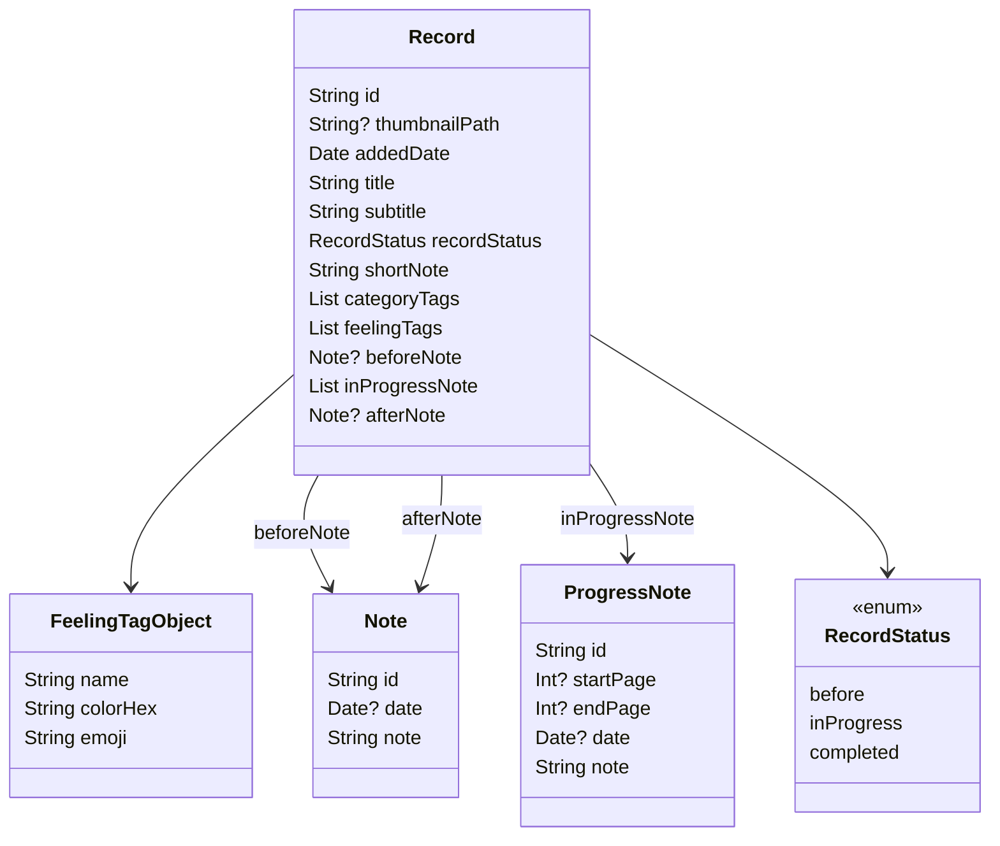

# 📚 RecordKit - 경량 로컬 DB 매니저

책, 영화, 음악 등 다양한 콘텐츠의 감상 기록을 위한 **범용 로컬 데이터 모델 프레임워크**입니다.  
Realm 기반의 간결하고 확장 가능한 구조로, **다른 앱에서도 재사용 가능**한 기록 도메인을 제공합니다.

---
## 🚀 기획 동기

- `일관된 기록 관리`: 여러 종류의 콘텐츠(책, 영화, 음악 등)에 대해 일관된 방식으로 감상 기록을 관리하고자 했습니다. 여러 앱에서 유용하게 사용할 수 있는 구조로 설계하였습니다.

- `확장성 및 재사용성`: 여러 종류의 콘텐츠가 하나의 프레임워크에서 효율적으로 관리될 수 있도록 설계했습니다. 이 프레임워크를 통해 다양한 앱에서 공통된 기능을 재사용할 수 있습니다.

---

## 💡 주요 기능

- ✅ `Realm` 기반의 CRUD 처리
- ✅ `RecordEntity`를 중심으로 한 범용 기록 모델
- ✅ 콘텐츠별 상세 정보 관리 (책, 영화, 음악 등 확장 가능)
- ✅ 감정 태그 / 진행 메모 기능 포함
- ✅ 재사용성과 확장성을 고려한 **도메인-데이터 분리 구조**

---

## 🧱 프로젝트 구조 및 설계

```bash
RecordKit/
├── Domain/            # 핵심 도메인 모델과 UseCase
│   ├── Entities/      # RecordEntity, DetailEntity 등
│   ├── Repositories/  # 추상화된 저장소 인터페이스
│   └── UseCases/      # 비즈니스 로직
├── Data/
│   └── Realm/         # Realm 기반 구현체
│       ├── Models/    # RealmObject 모델
│       ├── Mapper/    # Entity ↔ RealmObject 변환
│       ├── DataSource/ 
│       └── Repositories/
├── Interface/
│   └── RecordKit.swift # 외부 노출 진입점
└── Tests/             # 단위 테스트

dependencies: [
    .package(url: "https://github.com/yourname/RecordKit.git", from: "1.0.0")
]
```

#### RecordKit/

- **Domain/**
    - 핵심 도메인 모델과 UseCase를 정의하여 비즈니스 로직을 분리합니다.
    - RecordEntity, DetailEntity 등과 같은 도메인 모델을 정의하여 프레임워크의 재사용성과 확장성을 확보합니다.

- **Data/**

    - 데이터와 관련된 로직을 처리하는 Realm 기반의 구현체를 담고 있습니다.
    - Models/는 RealmObject로 실제 데이터 구조를 구현하며, Mapper/를 통해 도메인 모델과 Realm 모델 간의 변환을 처리합니다.

- **Interface/**
    - 외부에서 사용될 주요 인터페이스를 정의하여 프레임워크의 진입점을 제공합니다.

- **Tests/**
    - 단위 테스트를 통해 각 모듈의 독립적인 테스트 가능성을 확보하여, 유지보수가 용이한 구조를 갖추고 있습니다.


---
## Record (Realm)


--- 
## Record Entity (Domain)

```mermaid
 classDiagram
    RecordEntity --> MetadataEntity
    RecordEntity --> DetailEntity
    RecordEntity --> NoteEntity : beforeRecord
    RecordEntity --> NoteEntity : afterRecord
    RecordEntity --> ProgressNoteEntity : inProgressRecord
    DetailEntity --> FeelingTag

    class RecordEntity {
        String id
        MetadataEntity metaData
        DetailEntity detail
        NoteEntity? beforeRecord
        [ProgressNoteEntity] inProgressRecord
        NoteEntity? afterRecord
    }

    class MetadataEntity {
        String title
        String subtitle
        Date addedDate
        String? thumbnailPath
    }

    class DetailEntity {
        StatusEntity status
        String shortNote
        [String] categoryTags
        [FeelingTag] feelingTags
    }

    class FeelingTag {
        String name
        String colorHex
        String emoji
    }

    class NoteEntity {
        UUID id
        Date? date
        String note
    }

    class ProgressNoteEntity {
        UUID id
        String? startPage
        String? endPage
        Date? date
        String note
    }

 ``` 
 ---

 ## ⚙️ 테스트 가능성 및 유지보수성

- 레이어 분리로 각 레이어가 독립적으로 테스트 가능

- 단위 테스트를 통해 안정적인 코드 유지

- 확장성과 유지보수성을 고려한 설계로, 기능 추가 시 다른 부분에 미치는 영향 최소화
 ---
 